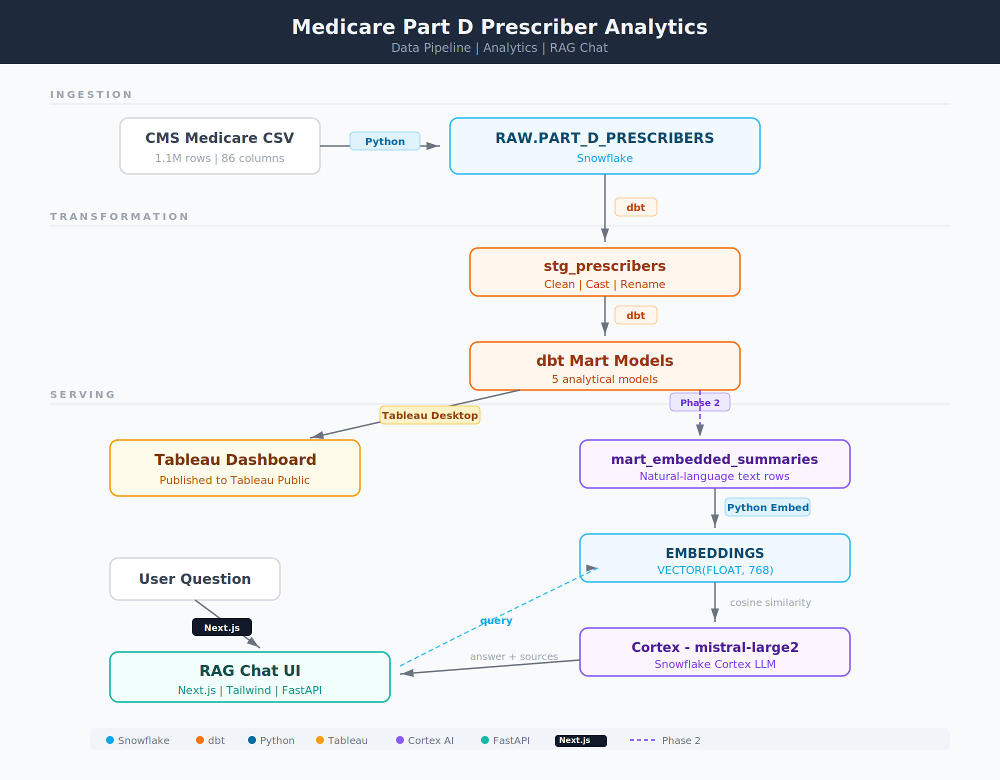

# CMS Medicare Prescriber Analytics & RAG Chat

An end-to-end data engineering and AI portfolio project that transforms **1.1 million CMS Medicare Part D prescriber records** into an interactive analytics dashboard and a retrieval-augmented generation (RAG) chat application — all powered by Snowflake Cortex, dbt, FastAPI, and Next.js.

---

## Architecture



---

## What This Project Does

Medicare Part D covers prescription drug costs for ~50 million Americans. CMS publishes prescriber-level data annually, but the raw dataset (1.1M rows, 86 columns) is nearly impossible to explore without tooling. This project:

1. **Transforms** raw CMS data into clean, analytics-ready aggregates using dbt on Snowflake
2. **Visualizes** prescribing patterns, drug spend, opioid outliers, and state-level trends in a Tableau dashboard (Phase 1)
3. **Enables natural-language querying** via a RAG chat application (Phase 2) — ask *"Which specialties prescribe the most opioids?"* and get answers grounded in real data

---

## Tech Stack

| Layer | Technology | Purpose |
|-------|-----------|---------|
| Cloud Data Warehouse | Snowflake | Storage, compute, vector search, LLM inference |
| Data Transformation | dbt-snowflake 1.8 | Staging + mart models, schema tests |
| Analytics / BI | Tableau Desktop + Tableau Public | Interactive dashboard, portfolio hosting |
| Backend API | FastAPI (Python) | REST endpoint for RAG chat |
| AI / RAG | Snowflake Cortex (`EMBED_TEXT_768`, `COMPLETE`) | Embeddings + LLM generation — no external AI API |
| Frontend | Next.js 14 (App Router) + Tailwind CSS | Chat UI |
| Config | Pydantic Settings | Type-safe environment variable management |
| Linting | Ruff | Python formatting and linting |

---

## Data Pipeline

### Source Data

CMS publishes [Medicare Part D Prescriber data](https://data.cms.gov/provider-summary-by-type-of-service/medicare-part-d-prescribers) annually. The dataset contains **~1.1 million prescriber records** with drug-level claim counts, costs, beneficiary demographics, and opioid/antibiotic-specific metrics.

### Stage 1 — Raw Ingestion

`scripts/load_to_snowflake.py` loads the CSV into `RAW.PART_D_PRESCRIBERS` using Snowflake's `PUT` + `COPY INTO` commands.

### Stage 2 — dbt Staging (`stg_prescribers`)

The staging model handles three key data quality issues present in the raw CMS data:

- **Suppression markers** — CMS replaces small counts with `*` or `#` to protect beneficiary privacy. Converted to `NULL` using `TRY_TO_NUMBER(NULLIF(NULLIF(col, '*'), '#'))`.
- **Type casting** — all numeric columns arrive as `VARCHAR` from the CSV; staging casts them to `NUMBER`.
- **Column renaming** — cryptic CMS names (e.g., `PRSCRBR_STATE_ABRVTN`, `ANTBTC_TOT_DRUG_CST`) renamed to readable snake_case.

Rows with null specialty, null state, or non-US providers are filtered out.

### Stage 3 — dbt Marts

Five aggregate tables built from `stg_prescribers`, each materialized as a Snowflake **table** in the `PUBLIC_MARTS` schema:

| Model | Description | Key Columns |
|-------|-------------|-------------|
| `mart_specialty_spend` | Drug spend by specialty with cumulative % | `specialty`, `total_spend`, `cumulative_pct` |
| `mart_state_spend` | Spend and beneficiaries by state | `state`, `total_drug_spend`, `cost_per_beneficiary` |
| `mart_branded_generic` | Branded vs generic drug split by specialty | `specialty`, `branded_pct`, `generic_pct` |
| `mart_opioid_outliers` | Prescribers >40 pts above specialty opioid average | `prescriber_npi`, `opioid_rate`, `deviation_from_avg` |
| `mart_dashboard_master` | State × specialty cross-tab for dashboard filters | `state`, `specialty`, `total_drug_spend`, `avg_opioid_rate` |

**24/24 schema tests pass** (not_null, unique, accepted_values).

---

## Project Structure

```
cms_medicare_rag/
├── dbt/
│   ├── dbt_project.yml               # Project config — staging=view, marts=table
│   ├── profiles.yml                  # Snowflake connection via env vars
│   └── models/
│       ├── staging/
│       │   ├── sources.yml           # Source: RAW.PART_D_PRESCRIBERS
│       │   ├── stg_prescribers.sql   # Clean, cast, rename raw columns
│       │   └── schema.yml
│       └── marts/
│           ├── mart_specialty_spend.sql
│           ├── mart_state_spend.sql
│           ├── mart_branded_generic.sql
│           ├── mart_opioid_outliers.sql
│           ├── mart_dashboard_master.sql
│           └── schema.yml
│
├── backend/                          # FastAPI app (Phase 2)
│   └── app/
│       ├── main.py
│       ├── config.py
│       ├── routers/chat.py           # POST /api/chat
│       ├── services/
│       │   ├── snowflake.py          # Connection + query runner
│       │   ├── retrieval.py          # Embed query + cosine similarity
│       │   └── generation.py        # Prompt builder + COMPLETE()
│       └── models/schemas.py
│
├── scripts/
│   ├── load_to_snowflake.py          # CSV → RAW table
│   └── generate_embeddings.py        # Summaries → EMBEDDINGS table (Phase 2)
│
├── frontend/                         # Next.js chat UI (Phase 2)
├── cortex/                           # Snowflake Cortex SQL helpers (Phase 2)
├── docs/
│   └── architecture.png              # Architecture diagram
├── requirements.txt
└── .env.example
```

---

## Phase 1 — Tableau Dashboard

Tableau Desktop connects live to the `PUBLIC_MARTS` schema in Snowflake. The dashboard covers:

- **State map** — total drug spend and cost per beneficiary by state
- **Specialty breakdown** — top specialties by spend with Pareto cumulative %
- **Branded vs Generic** — stacked bar by specialty showing brand/generic split
- **Opioid outliers** — prescribers flagged as high outliers vs their specialty average
- **Cross-filter** — state + specialty filters driving all views via `mart_dashboard_master`

Published to [Tableau Public](#) *(link coming soon)* for portfolio access.

---

## Phase 2 — RAG Chat Application

The second phase adds a natural-language chat interface powered entirely by Snowflake Cortex — no external vector database or AI API required.

**How it works:**
1. `mart_embedded_summaries` converts each mart row into a natural-language string — e.g., *"Specialty: Cardiology. Total prescribers: 4,231. Top drug: Atorvastatin with 128K claims costing $14.2M."*
2. `generate_embeddings.py` calls Snowflake's `EMBED_TEXT_768()` on each summary and stores 768-dimensional vectors in an `EMBEDDINGS` table (~10K–50K rows, not 1.1M)
3. At query time, FastAPI embeds the user question, runs `VECTOR_COSINE_SIMILARITY` to retrieve the top-K relevant summaries
4. Snowflake's `COMPLETE('mistral-large2', ...)` generates a grounded answer from those summaries
5. The Next.js UI displays the answer with collapsible source cards showing exactly which summaries were used

**API contract:**

```json
POST /api/chat

Request:  { "question": "Which specialties prescribe the most opioids?", "history": [...] }
Response: { "answer": "The top three specialties...", "sources": [{ "summary_type": "...", "summary_text": "..." }] }
```

---

## Roadmap

- [x] dbt staging model (`stg_prescribers`)
- [x] dbt mart models (5 tables, 24 tests passing)
- [ ] Tableau dashboard — published to Tableau Public
- [ ] FastAPI backend — `/api/chat` endpoint with retrieval + generation
- [ ] Snowflake Cortex embeddings + vector search
- [ ] Next.js chat frontend

---

## Skills Demonstrated

| Skill | Where |
|-------|-------|
| dbt (staging, marts, tests, sources) | `dbt/models/` |
| Snowflake (SQL, data loading, Cortex AI functions) | All layers |
| Data modeling (aggregation patterns, dimensional design) | `dbt/models/marts/` |
| Python (ETL scripts, FastAPI, Pydantic) | `scripts/`, `backend/` |
| RAG / LLM application design | `backend/services/`, `frontend/` |
| Tableau (live Snowflake connection, dashboard design) | Tableau Public |
| Git / version control | This repo |
